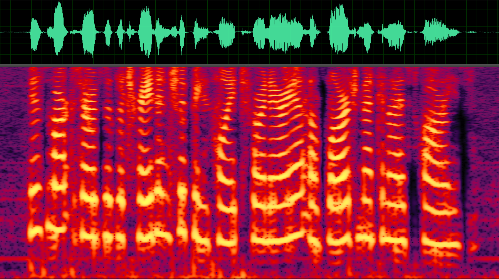

# LSTM_PIT Training for Two Speakers
The progress made in multitalker mixed speech separation and recognition, often referred to as the "cocktail-party problem", has been less impressive. Although human listeners can easily perceive separate sources in an acoustic mixture, the same task seems to be extremely difficult for computers, especially when only a single microphone recording the mixed-speech.



## Speration Performance
DL Method |  SDR | SAR | SIR | STOI | PESQ 
:-: | :-: | :-: | :-: | :-: | :-: |
BLSTM | # | # | # | # | #
LSTM  | # | # | # | # | #

* DL: Deep Learning
* Speech Speration Performance Evaluation Method:
  * SDR: Source to Distortion Ratio
  * SAR: Source to Artifact Ratio
  * SIR: Source to Interference Ratio
  * [STOI](http://cas.et.tudelft.nl/pubs/Taal2010.pdf): Short Time Objective Intelligibility Measure
  * [PESQ](https://ieeexplore.ieee.org/document/941023/): Perceptual Evaluation of Speech Quality

## Dependency Library
* [librosa](https://librosa.github.io/)
* Matlab (my test version: R2016b 64-bit)
* Tensorflow (my test version: 1.4.0)
* Anaconda3 (Contains Python3.5+ and so on)

## Usage
#### Prepare training data
The file structure of training data is as follows:
```
project
│ - README.md
│ - file001.txt    
│
│ - folder1
│   │ - file011.txt
│   │ - file012.txt
│   │
│   └───subfolder1
│       │ - file111.txt
│       │ - file112.txt
│       │ - ...
│   
└───folder2
    │ - file021.txt
    │ - file022.txt
```
haha
```
storage/
├── lists
│   ├── cv_tf.lst
│   ├── cv_wav.lst
│   ├── tr_tf.lst
│   ├── tr_wav.lst
│   ├── tt_tf.lst
│   └── tt_wav.lst
├── separated
├── TFCheckpoint
└── tfrecords
    ├── cv_tfrecord
    ├── tr_tfrecord
    └── tt_tfrecord
```

#### Run the command line script:
```bash
bash run.sh
```
which contains three steps:
1. Extract STFT features, and convert them to the tfrecords format of Tensorflow.
2. Train the deep learning neural network.
3. Decode the network to generate separation results.

## Reference Paper & Code
I'd like to thank Dong Yu et al for the paper and Sining Sun, Unisound for sharing their code.
* __Paper__: Permutation Invariant Training of Deep Models for Speaker-Independent Multi-talker Speech Separation.
* __Authors__: Dong Yu, Morten Kolbæk, Zheng-Hua Tan, Jesper Jensen
* __Published__: [ICASSP 2017](https://ieeexplore.ieee.org/document/7952154/) (5-9 March 2017)
* __Code__: [snsun/pit-speech-separation](https://github.com/snsun/pit-speech-separation), [Unisound/SpeechSeparation](https://github.com/Unisound/SpeechSeparation), [IOA-HCCL/pit-speech-separation](https://github.com/IOA-HCCL/pit-speech-separation)
* __Dataset__: [WSJ0 data](https://catalog.ldc.upenn.edu/ldc93s6a)
* __Create Mixed Speech Method__: Please click here - [create_speaker_mixtures.zip](http://www.merl.com/demos/deep-clustering/create-speaker-mixtures.zip).

## Follow-up Work
I will study on speech separation for a long time. You can pay close attention to my recent work if interested.
